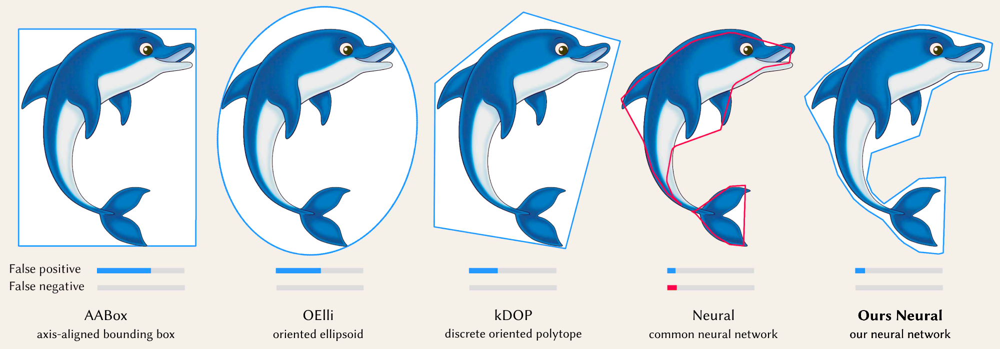

# Neural Bounding

PyTorch implementation of [Neural Bounding](https://arxiv.org/abs/2310.06822), using neural networks to represent
bounding volumes and learning conservative space classification.

Neural Bounding  
Wenxin Liu<sup>1</sup>, Michael Fischer<sup>2</sup>, Paul D. Yoo<sup>1</sup>, Tobias Ritschel<sup>2</sup>  
<sup>1</sup>Birkbeck, University of London, <sup>2</sup>University College London  
arXiv preprint arXiv:2310.06822  
2023

[[Paper](https://arxiv.org/abs/2310.06822)]
[[Project Page](https://wenxin-liu.github.io/neural_bounding)]



## Overview

Bounding volumes are an established concept in computer graphics and vision tasks but have seen little change since
their early
inception. In this work, we study the use of neural networks as bounding volumes. Our key observation is that bounding,
which
so far has primarily been considered a problem of computational geometry, can be redefined as a problem of learning to
classify
space into free or occupied. This learning-based approach is particularly advantageous in high-dimensional spaces, such as
animated scenes with complex queries, where neural networks are known to excel. However, unlocking neural bounding
requires
a twist: allowing – but also limiting – false positives, while ensuring that the number of false negatives is strictly
zero. We enable
such tight and conservative results using a dynamically-weighted asymmetric loss function. Our results show that our
neural
bounding produces up to an order of magnitude fewer false positives than traditional methods.

## Installation

### Prerequisites
To get started with running experiments and calculating results, make sure you have the following prerequisites:

- **Anaconda**: You will need Anaconda to create a virtual environment and manage the required dependencies. If you
   don't have Anaconda installed, you can download it from [here](https://www.anaconda.com/products/distribution) and
   follow the installation instructions for your specific platform.

### Run instructions
Once you have the prerequisites in place, follow these steps to set up the environment and run the experiments:

1. Clone this repository to your local machine:

   ```bash
   git clone https://github.com/wenxin-liu/neural_bounding.git
   ```
2. Navigate to the project's root directory:

   ```bash
   cd neural_bounding
   ```

3. Create a Conda environment to manage dependencies. You can use the provided environment.yml file: 
   ```bash
   conda env create -f environment.yml
   ```
4. Activate the Conda environment:
   ```bash
   conda activate neural_bounding
   ```
5. Now, you're ready to run the experiments and calculate results.
   ```bash
   ./run.sh
   ```
   This makes all experiments results as absolute values, per task (indicator dimension and query), method and object.
   <BR><BR>
   Then it calculates Table 1 of the paper using the above experiment results.
   <BR><BR>
   All results are saved as CSV files in `<project_root>/results`.

## Data

### Data Formats

- **2D Data**: For 2D experiments (2D point, ray, plane, and box queries), we use PNG images of single natural objects in front of a transparent background. In these images, the alpha channel serves as a mask, defining the indicator function. We use a total of 9 such images.

- **3D Data**: In 3D experiments (3D point, ray, plane, and box queries), we use 3D voxelizations in binvox format. We use 9 such voxelizations.

- **4D Data**: For 4D experiments (4D point, ray, plane, and box queries), we investigate sets of animated objects. In these experiments, we randomly select shapes from our 3D data and create time-varying occupancy data by rotating them around their center. This results in a 4D tensor, where each element represents a 3D voxelization of the object at a specific point in time, saved in .npy format.

### Using Your Own Data

If you wish to apply this code to your own datasets, you can follow these steps:

1. Ensure that your data is in a format compatible with the dimension you are working with (2D, 3D, or 4D).

2. Place your custom data in the appropriate directories:
   - For 2D data, add your PNG images to the `data/2D` directory.
   - For 3D data, add your binvox voxelizations to the `data/3D` directory.
   - For 4D data, prepare your 4D tensor in .npy format and save it in the `data/4D` directory.  

3. Modify the `run.sh` script to include the file names of your custom data. 
   - For example, if you have a 2D image named "bunny.png" and placed in the `data/2D` directory, modify the 2D section of `run.sh` to include `"bunny"` in the list of objects.  

4. Follow the installation instructions in the above section.


## Citation

```bibtex
@article{liu2023neural,
     title={Neural Bounding},
     author={Liu, Wenxin and Fischer, Michael and Yoo, Paul D. and Ritschel, Tobias},
     year={2023},
     eprint={arXiv:2310.06822},
     archivePrefix={arXiv},
     primaryClass={cs.GR}
}
```